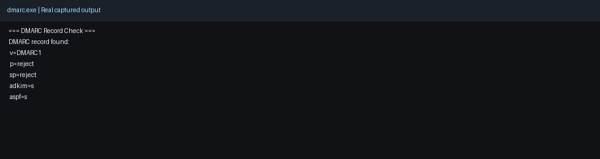
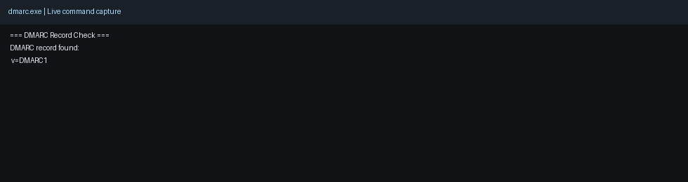

# DMARC.exe

A DMARC and email-auth workflow toolkit focused on operational reliability and analyst speed.

## Why this project

- **Impact:** Reduces manual effort in DMARC validation, parsing, and reporting workflows.
- **Scale:** Supports direct CLI use and automation-friendly execution paths.
- **Use case:** Domain email-auth auditing, report parsing, and operational monitoring.

## Demo media

- Screenshot: 
- Demo GIF: 

## Capability snapshot

- DMARC record validation and XML parsing
- Optional advanced reporting and metrics components
- Daily-run and cron-oriented workflow support

## Core Features (Low Risk, High Certainty)

- ✅ Check if a domain has a valid DMARC record
- ✅ Parse zipped DMARC XML aggregate reports
- ✅ CLI-compatible and self-contained

## Advanced Features (High Risk, High Reward)

- 🚀 Prometheus-style `/metrics` export
- 🚀 AbuseIPDB auto-takedown script
- 🚀 GPT-powered DMARC forensic summariser

---

## Repo Structure

dmarc.exe  
├── core/  
│ ├── dmarc_parser.py # Parses .gz XML reports  
│ └── dmarc_checker.py # Checks DMARC TXT DNS record  
├── advanced/  
│ ├── prometheus_exporter.py # Flask app for /metrics  
│ ├── abuse_reporter.py # Auto-abuse IP reporting  
│ └── gpt_summariser.py # Uses GPT to summarise findings  
├── data/ # Put sample reports here  
├── config/  
│ └── config.ini # API keys and secrets (excluded from git)  
├── scripts/  
│ ├── run_daily.sh # Cron/automation entry point  
│ └── cron_example.txt # Crontab example  
├── main.py # Demo runner  
├── requirements.txt  
├── .gitignore  
└── README.md  

---

## Install Dependencies

To install all necessary packages:

```bash
pip install -r requirements.txt
```

---

## Usage

This tool parses DMARC XML reports and displays per-IP activity, DMARC policy outcomes, and optionally exports data to Prometheus metrics or reports abusers to AbuseIPDB.

### Basic Usage

```bash
python main.py example.com
```
This command:  
-Checks the DMARC record for example.com  
-Parses the sample report at data/sample_report.xml.gz  
-Outputs results to the terminal  

### CLI Modes

Run only DMARC check:

```bash
python main.py example.com --check-only
```

Run only report parsing:

```bash
python main.py --parse-only --report data/sample_report.xml.gz
```

Use a custom report path while checking a domain:

```bash
python main.py example.com --report /path/to/report.xml.gz
```

## Goals
-Give threat intel and mail engineers rapid insight into spoofing attacks  
-Enable visibility and automation at any scale — even cron  
-Experiment with AI, not depend on it

## Quick Demo

```bash
# 1) Run a core check
# 2) Request JSON output
# 3) Pipe into jq for analyst workflows
```

